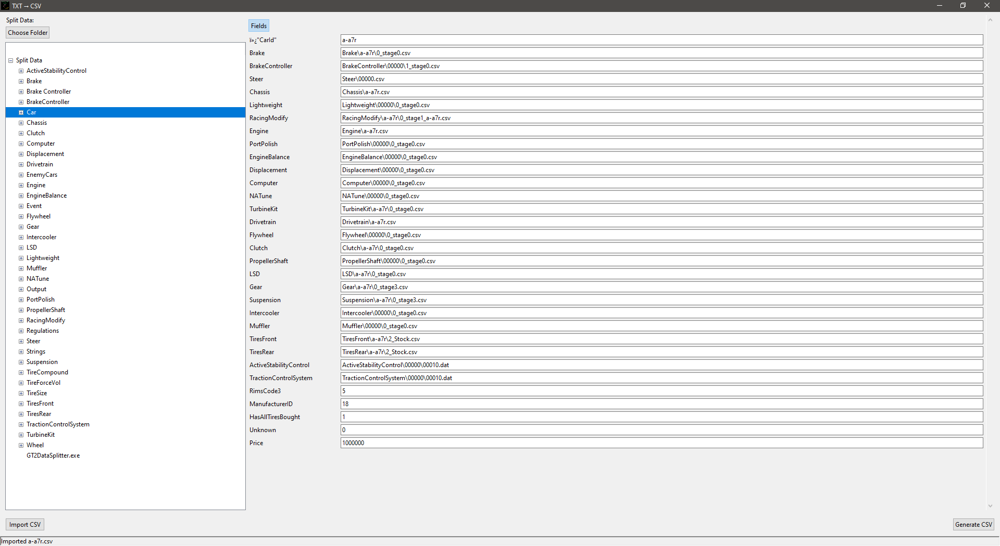

# TXT2CSV

A simple Python script to convert text files into `.csv` format for Gran Turismo 2 (GT2).

> **Note:** Generated `.csv` files will need to be renamed manually after generation (e.g., `Brake_f6ec970c-6454-4ad8-b28c-7c063e5eeb96.csv` → `0_stage0.csv`).

---

## 🖥️ New GUI Tool (v0.2+)

This repository now includes a Updated GUI (`TXT2CSVv0.2.py`) to browse and edit split CSV data:

- Left-hand Tree View: choose "Split Data" folder and browse subfolders/files.
- Double-click a `.csv` in the tree to open it — the form is built from the CSV headers.
- Responsive form: input boxes expand to fill available width.
- CarId autofill: when `CarNameFirstPart` and `CarNameSecondPart` are present, `CarId` auto-populates.
- The selected Split Data folder is remembered in `config.json`.

### Screenshots

CSV Editing:



### Running the GUI

```bash
python TXT2CSVv0.2.py
```

On first run the app will prompt to locate your Split Data folder (or it will auto-open the previously saved folder from `config.json`).

## 📦 Prerequisites

Before running the script, ensure you have the following installed:

* **Python 3.x**: Download and install from [python.org](https://www.python.org/downloads/).

---

## 🛠️ Usage

1. **Clone or Download the Repository**

   ```bash
   git clone https://github.com/JeevesGB/TXT2CSV.git
   cd TXT2CSV
   ```

2. **Run the Script**

   Execute the Python script to convert your text files:

   ```bash
   python TXT2CSVv0.1.py
   ```

   The script will process the text files in the current directory and generate corresponding `.csv` files.

3. **Rename the Output Files**

   After conversion, rename the generated `.csv` files manually to match the desired naming convention (e.g., `Brake_f6ec970c-6454-4ad8-b28c-7c063e5eeb96.csv` → `0_stage0.csv`).

---

## 📄 License

This project is licensed under the MIT License. See the [LICENSE](LICENSE) file for details.

---


